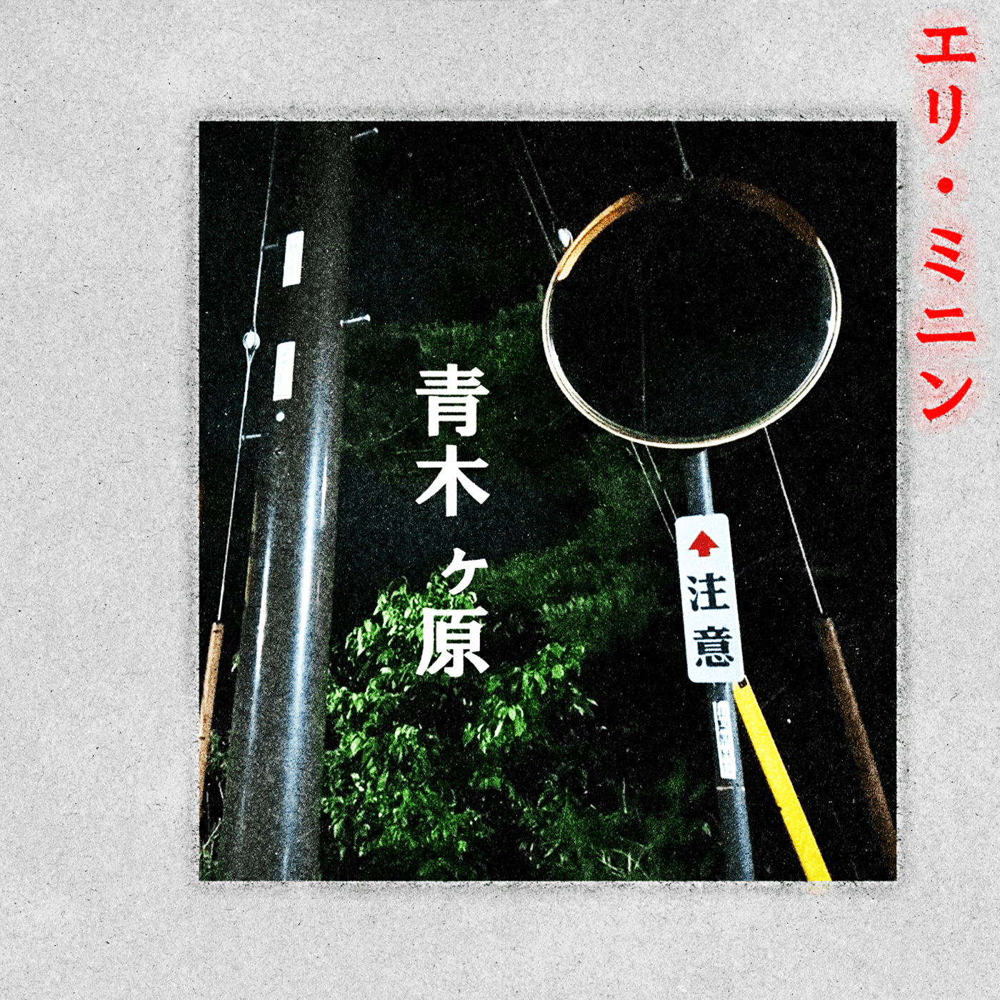

# エリ・ミニン / 青木ヶ原

**2026 / project**

A public archive of the Fuji Sonic Pi works: finished renders, short notes, and links to the final high-quality releases.

The Sonic Pi source code is intentionally not published here. JIHANKI stores the audible result and the documentation around it.

---

## 01 — 青木ヶ原

[▶ PLAY RENDER 01](../../media/music/fuji-sonicpi-01.mp3)

Short description of the first piece.

## 02 — 西湖

[▶ PLAY RENDER 02](../../media/music/fuji-sonicpi-02.mp3)

Short description of the second piece.

## 03 — 村

[▶ PLAY RENDER 03](../../media/music/fuji-sonicpi-03.mp3)

Short description of the third piece.

## 04 — 富士山

[▶ PLAY RENDER 04](../../media/music/fuji-sonicpi-04.mp3)

Short description of the fourth piece.

---

## NOTES

The four MP3 files above are the public renders of the Fuji Sonic Pi work. The Markdown file is the place for the explanation, context, process notes, credits, dates and field-recording information.

You can extend this page freely without changing the JIHANKI interface.

---

## HQ RELEASE

[LISTEN / DOWNLOAD THE HQ VERSION ON BANDCAMP](https://bandcamp.com/)

> Replace the Bandcamp URL above with the actual release page.

---

## CREDITS

**Project:** エリ・ミニン / 青木ヶ原 
**Year:** 2026  
**Archive:** JIHANKI
